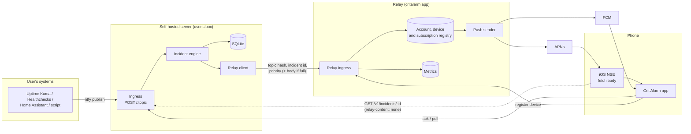
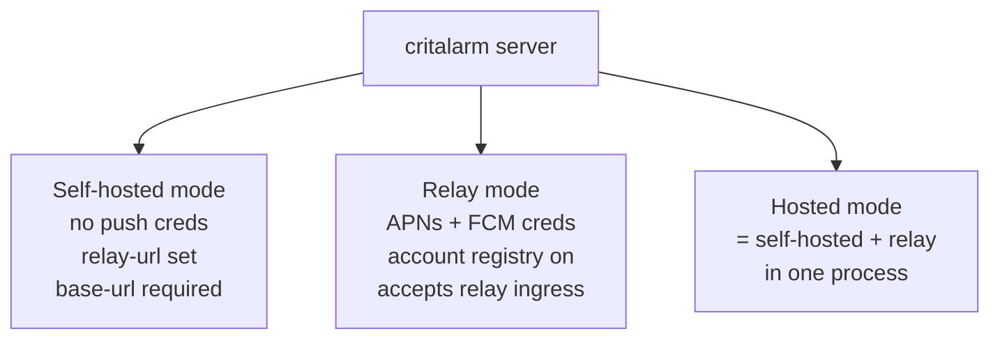
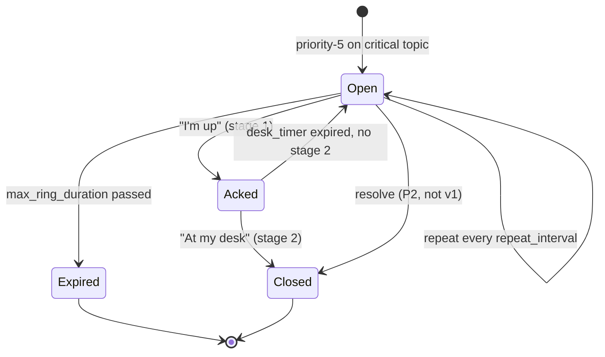
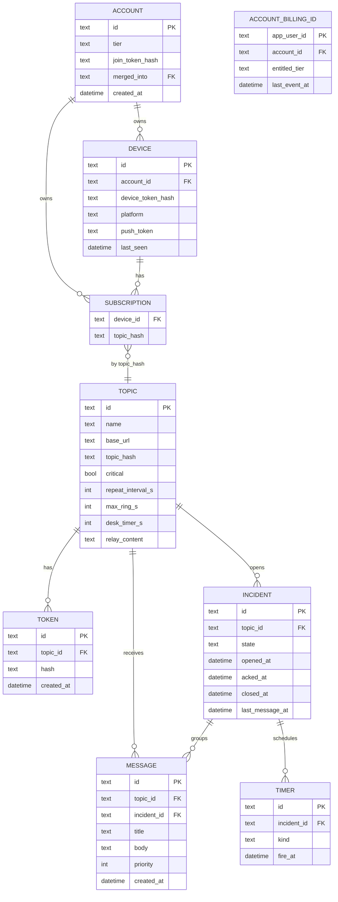
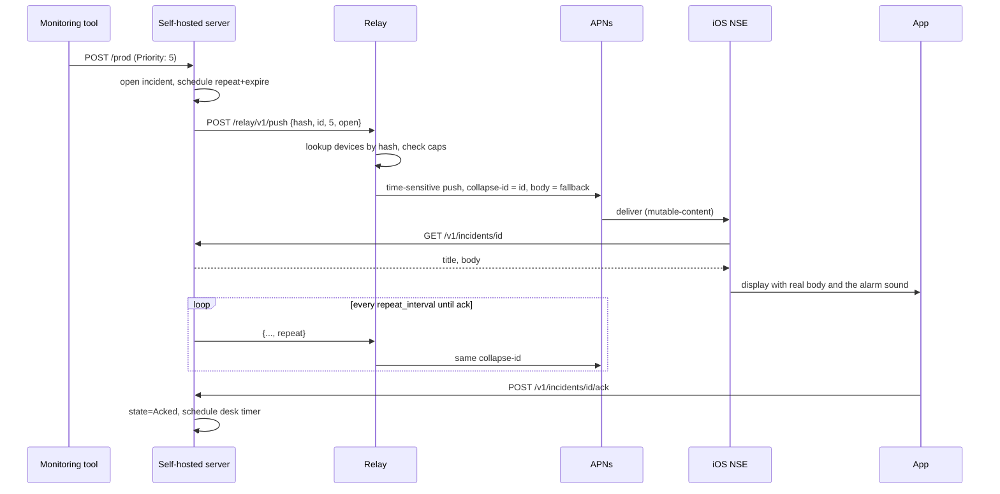

# Crit Alarm architecture

How the pieces fit and where every folder goes. Technical only. Product scope,
pricing and plans live outside this repo.

`docs/api.md` is the contract. Where this file and `api.md` disagree, `api.md`
is right, and the fix goes in `api.md` first.

---

## 2. Components



In hosted mode the two boxes collapse: the hosted server has push credentials,
so the incident engine calls the push sender directly and `FWD` and `RIN` are
skipped.

**The dashboard is the Flutter app, built for web.** When an account UI ships it
is `flutter build web` out of `critalarm-app`, deployed on its own
`critalarm.app` subdomain (not chosen yet), calling the same `/v1/` routes with
the same device token as the phone. A self-hosted server may also serve that
build at `/ui`. That is optional and self-hosted only: a hosted deployment
serves the dashboard from its own host, not from the API host. Next.js is not used. The web build
cannot register for push and cannot run the alarm, so the app gates those
screens on a capability instead of a platform check. No web UI is being built in
this pass. The decision is recorded here so nothing gets written against a
second framework.

## 3. Roles of the one binary



Mode is a setting: `MODE` in the environment or `mode:` in the config file, one
of `selfhosted`, `relay` or `hosted` (`docs/api.md` §3.4, contract 1.11.0). A
deployment that never sets it gets the old guess: no push credentials means
self-hosted, credentials without an explicit `relay-url` means relay,
credentials plus an explicit `relay-url` means hosted. Write it down; the guess
reads a self-hoster with their own APNs key as a relay. Self-hosted forwards
supported events to `relay-url` (default `https://relay.critalarm.app`). Relay
endpoints and account/device tables exist only in relay and hosted modes.

Mode also decides which credential the `/v1/` routes accept: the admin token in
self-hosted mode, a device token scoped to one account in relay and hosted mode.
See `docs/api.md` §3.

## 4. Incident lifecycle



Rules:

- One open incident per topic. A new priority-5 on a topic with an `Open` or
  `Acked` incident joins it (bumps `last_message_at`, does not create a new
  one). This is the flapping guard.
- Repeats reuse the incident ID as the push collapse key (`apns-collapse-id`,
  FCM `collapse_key`) so the phone shows one alert.
- Stage-two re-ring: `Acked` back to `Open` restarts the repeat loop with the
  original `max_ring_duration` counted from the re-open time.
- All timers are rows, not in-memory. See §7.

## 5. Priority mapping

| ntfy priority | Topic critical toggle | iOS | Android |
|---|---|---|---|
| 5 | on | AlarmKit alarm on iOS 26 or later, Time-Sensitive on older iPhones, incident opened | Full-screen alarm, incident opened |
| 5 | off | Time-Sensitive, no incident | High-priority notification, no incident |
| 4 | off or on | Time-Sensitive | High-priority |
| 1 to 3 | off or on | Standard, app polls | Standard, app polls |

Only priority 5 on a critical topic creates an incident and enters the retry
loop. Everything else is fire and forget, ntfy-style.

Apple denied the Critical Alerts entitlement for `app.critalarm`. On iOS 26 or
later a priority 5 page rings as an AlarmKit alarm, through the silent switch
and Do Not Disturb. On older iPhones the loudest delivery is a Time-Sensitive
push with sound, which the silent switch mutes. The topic critical switch still
decides whether an incident opens and whether the repeat loop runs, and it
still drives the Android full-screen alarm.

## 6. API

Do not restate the routes here. `docs/api.md` is the contract, it is versioned,
and a second copy in this file goes stale the first time the contract moves.

What matters architecturally:

- Two surfaces on one server. The ntfy-compatible publish and poll routes sit
  at the root so existing ntfy integrations work unchanged. Everything ntfy has
  no concept of (topics, tokens, incidents, ack) sits under `/v1/`.
- Anything ntfy accepts that Crit Alarm does not implement is accepted and
  ignored, never rejected. The one exception is `X-Delay`, because answering
  `200` to a scheduled message that will never be scheduled is a lie.
- The relay surface (`/relay/v1/`) is served only when push credentials are
  configured.

## 7. Data model



`ACCOUNT`, `ACCOUNT_BILLING_ID`, `DEVICE` and `SUBSCRIPTION` exist only in relay
and hosted mode. Self-hosted never stores a device, and has no tier, no caps and
no billing at all.

An account owns a subscription through its devices, not directly: a subscription
names only the device. Holding the account on the row as well meant a device
whose account changed kept a stale copy, so unsubscribing filtered on the old
value, deleted nothing, and still answered 204.

Billing is a lookup, not an identity. One account can hold several
`ACCOUNT_BILLING_ID` rows, because merging two accounts brings both sides'
subscriptions, and the account's tier is the highest live entitlement across
them. `merged_into` is how a webhook that arrives after a merge still finds the
surviving account.

**Why the account row exists.** A device is a handset. It gets replaced, wiped
and reinstalled. The account is the thing that owns topics, subscriptions, caps
and the purchase, and it survives all three. Registration creates one silently,
so there is still no sign-up screen. Adding sign-in later fills in one column
and migrates nothing. See `docs/api.md` §4.2.

**Deleting an account.** `DELETE /v1/account` and `critalarm account delete` run
the same erase, `deleteAccount` in `src/v1/accounts.ts`, in one transaction. It
takes the account, every tombstone whose `merged_into` chain ends at it, and
everything that cascades from those rows. Two tables do not cascade and are
handled by hand: `tier_changes` rows go, and `billing_events` rows stay with
`account_id` cleared, because they are the dedup log a late webhook still has to
land in. The better-auth `user` row is deleted by hand as well, since
`account_identities` carries no foreign key to it, and deleting it takes the
person's sessions and their stored OAuth tokens. Before the transaction the
server asks Apple and Google to revoke those tokens. That call is best effort
and never blocks the delete. See `docs/api.md` §3.7.

**Three secrets, three jobs.** A topic token (`tk_`) authorizes publishing and
goes out to whatever monitoring tool fires the alert. A device token (`dv_`)
authorizes managing topics and incidents and never leaves the app. An account
join token (`aj_`) attaches one more handset to the account and does nothing
else. Never mix them. See `docs/api.md` §4.2.

**Timers as rows.** `TIMER.kind` is one of `repeat`, `expire`, `desk`. One
`setInterval` every 250 ms selects `fire_at <= now`, handles each, then deletes
or reschedules (`src/main.ts`). On boot the same scan runs once. A crash loses
at most a quarter of a second of ringing, not the incident.

**How long rows live.** `history_days` is retention, not a number to show. On a
relay or hosted server `pruneHistory` in `src/retention/prune.ts` walks the
accounts once an hour, one transaction each, and deletes closed and expired
incidents older than that account's window along with their messages, plus any
message with no incident. An open or acked incident is never deleted, whatever
its age. The job has its own `setInterval`, separate from the 5 s timer scan,
and its first run is 60 s after boot. Between runs `historyCutoff` in
`src/retention/window.ts` hides the same rows from `GET /v1/incidents` and
`GET /{topic}/json`, so a read never shows what the next run will delete. A
self-hosted server has no tier and no window: it prunes nothing, filters
nothing, and there is no setting that turns this on. See `docs/api.md` §4.2.

## 8. Push path detail



If the NSE fetch fails (server down, proxy misconfigured, 30 s budget), the
fallback body is shown. The sound still plays because it is in the APNs payload,
not the fetched body. It plays at the phone's notification volume and it obeys
the silent switch, because Apple denied the Critical Alerts entitlement. On iOS
26 or later the AlarmKit alarm is scheduled by the app on its own and does not
depend on this fetch.

`relay-content: full` skips the NSE fetch: title and body are in the push.

## 9. Config (self-hosted)

```yaml
base-url: https://alerts.example.com   # required. must match what the app subscribes to
relay-url: https://relay.critalarm.app # default
relay-content: none                    # none | full
listen: :8080
data-dir: /data
behind-proxy: true
```

`relay-url` may be overridden with `RELAY_URL`. `relay-content` accepts `none`
or `full`; environment override is `RELAY_CONTENT`.

Nothing is printed at startup except the admin token on first boot. To see what
a running server actually loaded, call `GET /v1/info`. It needs no auth and it
answers with `base_url`, `relay_url`, `relay_content` and `mode`, so a
reverse-proxy mistake shows up there instead of in a 401 an hour later.

`LOG_REQUESTS=true` adds one line per request: method, path, status, duration.
Off by default. It carries no tokens, no message bodies and no push tokens, so
it is safe to turn on against a real deployment while chasing something. Push
failures log themselves either way, under `dispatch_failed`, because a publish
that answers 500 because a push provider is misconfigured used to give an
operator nothing at all to go on.

## 10. Trust and abuse

- No public topics. Every topic has a token from creation.
- The topic hash on the relay is `sha256(base_url + "/" + topic)`, ntfy's
  scheme. Knowing the hash lets you receive pokes for a topic, not send them.
  Sending needs the topic token on the user's server.
- The relay server key comes from `POST /relay/v1/servers`. Today that route
  only mounts when `RELAY_REGISTRATION_SECRET` is set and then demands it, and
  nothing rate-limits it. The contract still says anonymous; that gap is an
  open item in `planning/decisions.md`.
- Device routes need the device token issued at registration. Registration
  itself is the only unauthenticated relay route.
- A device token reaches only rows owned by its account. Another account's topic
  or incident answers `404`, never `403`, so the token cannot be used to find
  out which topic names exist.
- Relay caps: the per-account caps the relay returns in `caps` at registration.
  Caps are counted per account, not per device. No cap touches the alarm
  itself.
- The relay stores no message content in `none` mode. Metrics are counts and
  timings only.

## 11. Failure modes

| Failure | Effect | Mitigation |
|---|---|---|
| User's server down | Nothing new is sent, and an already-open incident stops repeating, because repeats originate on the server. | Accept for v1. Document it. P2: relay-side repeat. |
| Relay down | Self-hosted pushes stop. | The relay is one container behind Cloudflare. A second instance is the fix, and it is not v1. Document it. |
| APNs rejects token | Device never rings. | The relay marks the device stale on 410, the app re-registers on next launch, and "Ring me now" surfaces it. |
| Reverse proxy strips headers | Ingress 401s, or the topic hash does not match. | `GET /v1/info`, the `behind-proxy` setting, and a docs page for Caddy, Traefik and nginx. |
| Older iPhones cannot ring through silent mode | Apple denied the Critical Alerts entitlement. iOS 26 or later rings an AlarmKit alarm through silent mode; iOS 16 to 25 gets a Time-Sensitive push with sound. | Same code path. Android keeps the full-screen alarm. |
| Phone offline | Push queued by APNs and FCM up to their TTL. | Set `apns-expiration` to `max_ring_duration`. |

The first row is the honest weakness. If the box running Crit Alarm is the box
that died, there are no repeats. For someone running both on one machine the
first push still fires, as long as it is the monitored service that died and not
the host. Say this in the docs.

## 12. Repo layouts

This is the layout as of `v0.1.9`. `ls src/` is the check.

```
critalarm-server/
  src/
    ingress/       ntfy-compatible handlers
    incident/      state machine, timer scan. no push imports.
    relay/         client (forward) + server (accept), both, switched by config
    push/          apns.ts, fcm.ts, dispatcher.ts
    store/         better-sqlite3, migrations
    tier/          caps, revenuecat webhook and reconcile
    auth/          better-auth, sign-in link and switch, account merge
    admin/         admin token routes
    stats/         counts for the site
    v1/            topics, tokens, incidents, account routes
    config.ts
    main.ts        entry point
    cli.ts         the operator command (critalarm account delete)
  docs/api.md      the contract the app tests pin to
  Dockerfile       node:22-alpine, multi-arch
  docker-compose.yml

critalarm-app/
  lib/             Flutter. lib/features/<name>, 13 features (`ls lib/features`)
  ios/CritAlarmNSE/  Swift. fetch + mutate notification.
  android/         full-screen intent channel config
  integration_test/  hits a real server container

critalarm-site/
  src/pages/       landing, compare, works-with
  src/content/docs/  Starlight
```
